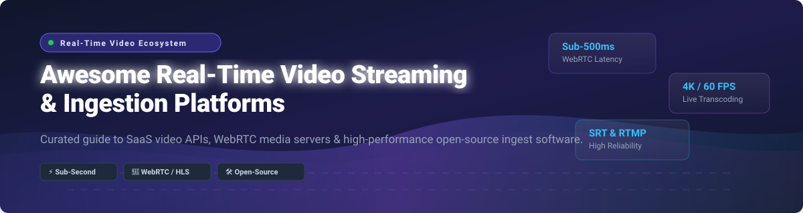

  

  
  
  
  
  

# 📹 Awesome Real-Time Video Streaming & Ingestion Ecosystem 🚀

> **A comprehensive, SEO-optimized, developer-curated list of SaaS live streaming platforms, real-time video ingestion APIs, ultra-low latency WebRTC media servers, and open-source video processing frameworks.**

---

## 📌 Table of Contents
- [🌐 Sector Market Size & Dynamics](#-sector-market-size--dynamics)
- [🏢 SaaS & Managed Cloud Platforms](#-saas--managed-cloud-platforms)
- [💻 Open-Source GitHub Projects](#-open-source-github-projects)
  - [⚡ Live Streaming & Ingestion Servers](#-live-streaming--ingestion-servers)
  - [💬 WebRTC & Real-Time Communications (RTC)](#-webrtc--real-time-communications-rtc)
  - [🎥 Media Processing, Encoding & Transcoding](#-media-processing-encoding--transcoding)
  - [🛠️ Additional Open-Source Libraries & Engines](#%EF%B8%8F-additional-open-source-libraries--engines)
- [🤝 How to Contribute](#-how-to-contribute)
- [💖 Support & Sponsorship](#-support--sponsorship)
- [📈 Star History](#-star-history)
- [⚠️ Disclaimer](#%EF%B8%8F-disclaimer)

---

## 🌐 Sector Market Size & Dynamics

> 📊 **Market Size & Structure**: The global **Real-Time Video Streaming & Live Ingestion Software** market is estimated at **$12.5 Billion+ (2025–2026)** and is projected to expand at a compound annual growth rate (CAGR) of over **18.4%** through 2030, driven by interactive live commerce, WebRTC cloud integration, sub-second gaming streams, and AI-powered computer vision ingestion.
> 
> 🧩 **Market Fragmentation**: The sector is **moderately fragmented**: hyper-scale cloud infrastructure providers (AWS Kinesis, Cloudflare Stream, Twilio) maintain dominance in enterprise raw egress and CDN infrastructure, while specialized API platform leaders (Mux, Agora, Livepeer) and vibrant open-source projects (SRS, MediaMTX, LiveKit, FFmpeg, OBS Studio) capture substantial developer mindshare.

---

## 🏢 SaaS & Managed Cloud Platforms

*Ranked by Company Size / Market Valuation / Revenue (Descending)* 📊

| Product | Description | Best For | Company Size / Valuation / Revenue | Starting Pricing Tier | Free Tier / Free Trial Limit |
| :--- | :--- | :--- | :--- | :--- | :--- |
| ☁️ **[AWS Kinesis Video Streams](https://aws.amazon.com/kinesis/video-streams/)** | AWS managed video streaming & ingestion service to ingest, store, and process live streams for ML & analytics. | AWS-native enterprise apps | **~$2.71 Trillion** (Parent Amazon Market Cap; AWS ARR ~$105B+) | Pay-as-you-go ($0.0085/GB ingest & consume, $0.023/GB-month storage in us-east-1) | No permanent free tier; pay-as-you-go from $0.00 |
| ⚡ **[Cloudflare Stream](https://www.cloudflare.com/products/stream/)** | Cloudflare video platform to upload, store, and deliver video globally with built-in CDN & low latency. | Simple video delivery | **~$148 Billion** (Market Cap; ~$2.17B Annual Revenue) | $5/month ($5 per 1,000 mins stored + $1 per 1,000 mins delivered) | No standalone free tier/trial (Cloudflare Pro/Biz includes 100 mins storage & 10k mins delivery/mo) |
| 📞 **[Twilio Video](https://www.twilio.com/video)** | Programmable WebRTC-based video platform to build custom video calling & interactive rooms. | Twilio ecosystem integrations | **~$54.31 Billion** (Market Cap; ~$5.57B TTM Revenue) | Pay-as-you-go ($0.004 per participant/minute for Video Group Rooms) | 30-day free trial (trial account with free test units, no credit card required) |
| 🎥 **[Mux Video](https://mux.com/)** | API-first video streaming platform to ingest, transcode, and deliver live and on-demand video with analytics. | Developer-first video apps | **~$1.0 Billion** (Valuation; ~$46.1M ARR) | Pay-as-you-go ($20 monthly usage credit included) | Free tier: 10 video assets storage, 100,000 delivery minutes/month, and 100,000 Mux Robots units/month |
| 🌐 **[Agora.io](https://www.agora.io/)** | Real-time engagement platform providing WebRTC video, voice, and interactive streaming SDKs. | Interactive live streaming | **~$350.88 Million** (Market Cap; ~$160M+ Annual Revenue) | Pay-as-you-go ($0.0039/min for voice, $0.0099/min for HD video after free allowance) | Free tier: 10,000 free participant minutes/month + 1M signaling messages/month |
| 🛍️ **[Bambuser](https://bambuser.com/)** | Interactive live video shopping and live commerce platform tailored for e-commerce brands. | Live commerce & e-commerce | **~$22.6 Million ARR** (Publicly Traded Nasdaq Stockholm: BUSER) | Essential plan starts at $326/month (billed annually) | Free tier: 250 views/month, 2 users, 10 GB storage |
| 📽️ **[Wowza Cloud](https://www.wowza.com/)** | Enterprise-grade live streaming & cloud transcode platform supporting ultra-low latency & ABR delivery. | Broadcast-grade streaming | **~$28.9 Million ARR** (Estimated revenue) | $25/month (usage-based) | 30-day free trial: 5 hours stream processing, max 10 concurrent viewers, 20-min max stream length, watermarked streams |
| ⛏️ **[Livepeer](https://livepeer.org/)** | Decentralized video streaming protocol with managed Livepeer Studio cloud transcode platform. | Decentralized video apps | **~$88.26 Million** (Market Cap / Token Market Value; ~$2.8M ARR) | Livepeer Studio Paid: $100/month minimum spend ($0.33/60 min transcoding, $0.03/60 min delivery) | Sandbox Free Tier: 1,000 transcoding minutes, 60 storage minutes, 5,000 delivery minutes/month |
| 📱 **[Dyte](https://dyte.io/)** | Real-time video & voice SDKs with customized UI components (now integrated into Cloudflare RealtimeKit). | Developer-friendly video apps | **~$8.4 Million ARR** (Acquired / Integrated into Cloudflare) | Pay-as-you-go (custom/metered pricing per participant minute) | Free tier: 10,000 free participant minutes/month (historical/community allowance) |
| 🚀 **[Ant Media Server Enterprise](https://antmedia.io/)** | Ultra-low latency WebRTC streaming server with scalable clustering and adaptive bitrate streaming. | Ultra-low latency enterprise WebRTC | **~$4.0 Million ARR** (Estimated annual revenue) | Enterprise: $0.24/hour pay-as-you-go or $109/month subscription | Community Edition is 100% free/open-source; Enterprise has 14-day free trial |

---

## 💻 Open-Source GitHub Projects

*Ranked by GitHub Stars_Count (Descending)* 🌟

### ⚡ Live Streaming & Ingestion Servers

* High-performance media servers capable of RTMP, SRT, WebRTC, RTSP, and HLS/DASH ingest and delivery.

1. 🎛️ **[OBS Studio](https://github.com/obsproject/obs-studio)**   
   **The leading open-source live streaming software**, GPL-2.0 licensed. **Supports scene composition, hardware encoding, RTMP, and SRT ingestion**. **De facto broadcast studio standard**.
2. 🚀 **[SRS (Simple Realtime Server)](https://github.com/ossrs/srs)**   
   **The leading open-source live streaming server**, MIT licensed. **Supports RTMP, HLS, SRT, WebRTC, and DASH**. **Scalable to millions of viewers**. **De facto open-source Wowza alternative**.
3. 📡 **[MediaMTX](https://github.com/bluenviron/mediamtx)**   
   **Zero-dependency real-time media server**, MIT licensed. **Supports SRT, WebRTC, RTSP, RTMP, HLS, and LL-HLS**. **Single binary for edge & IoT live video ingestion**.
4. 🔴 **[Nginx-RTMP Module](https://github.com/arut/nginx-rtmp-module)**   
   **RTMP streaming module for Nginx**, BSD-2-Clause licensed. **Simple RTMP streaming with HLS/DASH output**. **Best for lightweight RTMP ingestion**.
5. 📺 **[Owncast](https://github.com/owncast/owncast)**   
   **Self-hosted live streaming and chat server**, MIT licensed. **Single-binary Twitch alternative for independent video content creators**.
6. ⚡ **[Ant Media Server Community](https://github.com/ant-media/Ant-Media-Server)**   
   **Ultra-low latency streaming server**, Apache-2.0 licensed. **Sub-second latency with WebRTC, RTMP ingest, and HLS playback**.
7. 🔥 **[OvenMediaEngine](https://github.com/AirenSoft/OvenMediaEngine)**   
   **Sub-second latency streaming server**, AGPL-3.0 licensed. **Supports LL-HLS, WebRTC (OvenSRT), and SRT live ingest**.
8. 🔀 **[Restreamer](https://github.com/datarhei/restreamer)**   
   **Self-hosted live streaming software with Web UI**, Apache-2.0 licensed. **Restream live video to YouTube, Twitch, and custom RTMP endpoints**.

---

### 💬 WebRTC & Real-Time Communications (RTC)

* Scalable SFUs, WebRTC gateways, and conferencing platforms for interactive real-time video apps.

1. 🗣️ **[Jitsi Meet](https://github.com/jitsi/jitsi-meet)**   
   **The leading open-source video conferencing platform**, Apache-2.0 licensed. **WebRTC-based with scalable SFU architecture (Jitsi Videobridge)**.
2. 🐹 **[Pion WebRTC](https://github.com/pion/webrtc)**   
   **Pure Go implementation of WebRTC API**, MIT licensed. **No Cgo dependencies; ideal for high-concurrency Go video microservices**.
3. 📦 **[LiveKit](https://github.com/livekit/livekit)**   
   **Modern open-source WebRTC platform**, Apache-2.0 licensed. **Scalable SFU server with SDKs for React, iOS, Android, and Flutter**.
4. 🍲 **[mediasoup](https://github.com/versatica/mediasoup)**   
   **Cutting-edge WebRTC SFU library**, ISC licensed. **C++ core with Node.js signaling for building custom low-latency video infrastructure**.
5. 🏛️ **[Janus WebRTC Server](https://github.com/meetecho/janus-gateway)**   
   **General-purpose C WebRTC gateway**, GPL-3.0 licensed. **Modular C plugin architecture for VideoRoom, Streaming, and SIP gateways**.
6. 🌐 **[OpenVidu](https://github.com/OpenVidu/openvidu)**   
   **Open-source WebRTC video application developer platform**, Apache-2.0 licensed. **Simplifies video room creation with ready-to-use SDKs**.

---

### 🎥 Media Processing, Encoding & Transcoding

* Core video encoding frameworks, packaging tools, and hardware acceleration libraries.

1. ⚙️ **[FFmpeg](https://github.com/FFmpeg/FFmpeg)**   
   **The foundational multimedia processing framework**, LGPL/GPL licensed. **The media engine behind almost all video streaming infrastructure**.
2. 🧩 **[GStreamer](https://github.com/GStreamer/gstreamer)**   
   **Pipeline-based multimedia framework**, LGPL licensed. **Modular C media processing pipeline for hardware acceleration & edge ingestion**.
3. 📦 **[Shaka Packager](https://github.com/shaka-project/shaka-packager)**   
   **Media packaging SDK**, Apache-2.0 licensed. **DASH, HLS, and CMAF video packaging with Widevine & FairPlay DRM encryption**.

---

### 🛠️ Additional Open-Source Libraries & Engines

* **[Kurento](https://github.com/Kurento/kurento-media-server)**  — WebRTC media server & computer vision filter framework.
* **[Bento4](https://github.com/axiomatic-systems/Bento4)**  — C++ class library and tools for MP4, DASH, and HLS packaging.
* **[GPAC](https://github.com/gpac/gpac)**  — Multimedia framework supporting DASH, HLS, MP4Box, and 3D graphics rendering.
* **[FreeSWITCH](https://github.com/signalwire/freeswitch)**  — Telephony platform with support for multi-party video conferencing.
* **[Asterisk](https://github.com/asterisk/asterisk)**  — Open-source PBX engine with WebRTC and video pass-through capabilities.
* **[Red5 Server](https://github.com/Red5/red5-server)**  — Open-source Java media server for WebRTC and RTMP streaming.

---

## 🤝 How to Contribute

Contributions are welcome! Please follow these steps to keep the list clean and accurate:

1. 🍴 **Fork the repository**.
2. 📝 **Add/edit entries in `README.md`** following the established format and column structures.
3. 📌 **Include**: Name, official site/repo link, Stars_Badge (for open source), 1–2 sentence objective summary, and accurate pricing or Stars_Counts.
4. 🔀 **Submit a Pull Request (PR)** with a clear title and short explanation.

---

## 💖 Support & Sponsorship

If you found this curated list helpful for building your real-time video streaming architecture, please consider starring the repository ⭐, sharing it with fellow media engineers, or sponsoring the maintainers!

  

---

## 📈 Star History

---

## ⚠️ Disclaimer

- This is a **community-curated** repository provided for educational and architectural reference only.
- **Latency vs. Scalability Trade-offs**: WebRTC provides sub-second latency for interactive applications (scales to hundreds of peers per node); HLS/DASH scales to millions of viewers via CDN but adds 4–30 seconds latency.
- **Bandwidth Egress Costs**: Video streaming bandwidth scales linearly. Always verify cloud egress costs or self-hosted CDN setup before production deployment.
- Check licenses (MIT, Apache-2.0, AGPL-3.0, GPL-3.0) prior to incorporating open-source engines into commercial products.

---

  <b>Built with ❤️ for streaming engineers, media developers, and real-time video pioneers.</b> 
  <i>Curated by <a href="https://github.com/ishandutta2007">ishandutta2007</a> & awesome community contributors.</i>

